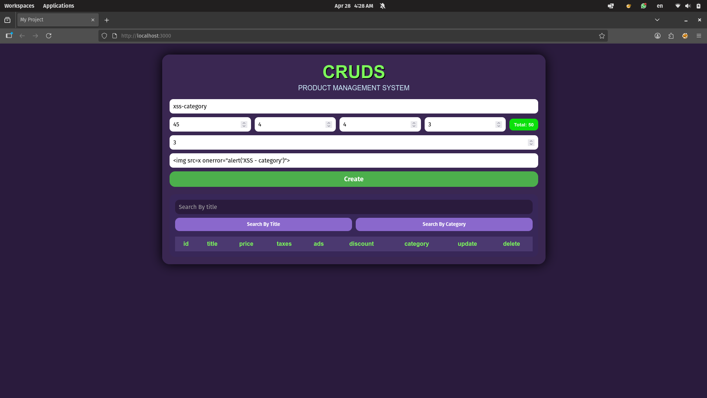
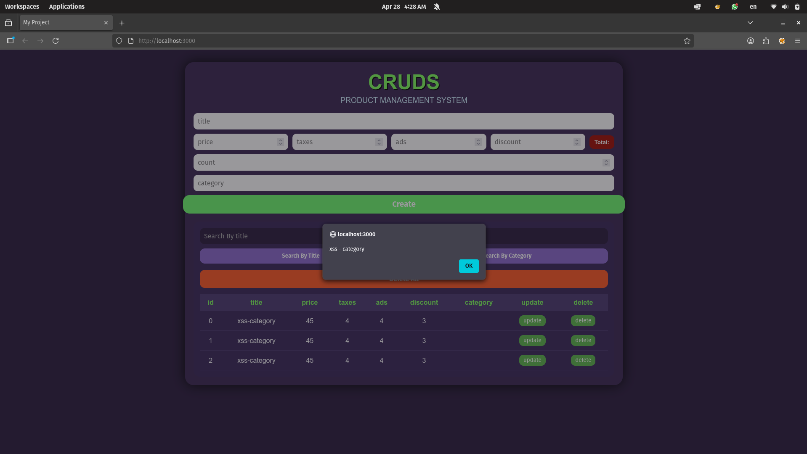
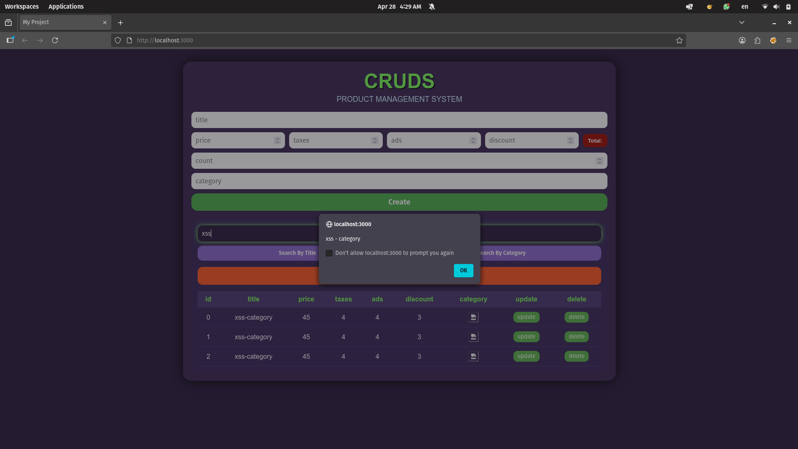

# Stored Cross-Site Scripting (XSS) Vulnerability Report

## Summary

A Stored Cross-Site Scripting (XSS) vulnerability was identified in the Product Management System.

User-controlled input is stored in `localStorage` and rendered using `innerHTML` without sanitization, allowing execution of arbitrary JavaScript in any user's browser.

---

## Vulnerability Details

| Field | Details |
|---|---|
| **Type** | Stored XSS (Persistent) + Reflected XSS (Search) |
| **Severity** | 🔴 High |
| **CVSS 3.1 Score** | 7.4 — `AV:N/AC:L/PR:N/UI:R/S:U/C:H/I:H/A:L` |
| **Affected Components** | Product Title Input, Product Category Input, Product Table Rendering, Search Function |
| **Status** | Unpatched |

---

## Root Cause

The application inserts user-controlled data into the DOM using `innerHTML` without validation or sanitization:

```javascript
// showdata()
table += `<td>${datapro[i].title}</td>`;
document.getElementById('tbody').innerHTML = table;

// SearchData()
table += `<td>${datapro[i].title}</td>`;
document.getElementById('tbody').innerHTML = table;
```

This allows malicious payloads to be interpreted as executable HTML/JavaScript.

---

## Steps to Reproduce

### Scenario 1 — Stored XSS

1. Navigate to the product creation form
2. Enter the following payload in the **Title** field:

```html

```

3. Click **Create**
4. The payload is stored in `localStorage`
5. The payload executes automatically when the product list is rendered. If the "count" field is greater than 1, multiple entries are created, causing the payload to execute multiple times (once per entry).
---

### Scenario 2 — Reflected XSS via Search

1. Search for the stored product
2. The payload executes again when results are rendered

---

### Scenario 3 — Persistent Execution

1. Reload the page
2. The `showdata()` function executes automatically
3. The payload executes again without additional input

---

## Evidence

### Payload Injection



### XSS Execution



### Search Execution



---

## Observed Behavior

* Payload executes automatically when rendering stored data
* Payload executes again during search
* Payload executes on every page reload (persistent behavior)
* Payload may execute multiple times due to repeated DOM rendering

---

## Additional Observations

### Multiple Execution Behavior

The payload executes multiple times in a single interaction due to repeated rendering of unsanitized data using `innerHTML`.

---

### Execution Amplification via Count Field

```javascript
for (let i = 0; i < count.value; i++) {
  datapro.push(newpro);
}
```

The **count** field allows storing multiple copies of the same payload.

This amplifies the attack by triggering multiple independent executions automatically.

---

### Persistence Across Sessions

Because data is stored in `localStorage`:

* Payload persists after page reload
* Payload persists across browser sessions
* Any user accessing the application will trigger the payload

---

## Impact

An attacker can:

* Execute arbitrary JavaScript in the victim's browser
* Steal sensitive data (tokens accessible via JavaScript)
* Manipulate or deface the UI
* Perform actions on behalf of the user
* Inject phishing content within the application
* Persist malicious payloads across sessions
* Amplify the attack via multiple stored entries

---

## CVSS v3.1 Breakdown

| Metric | Value | Reason |
|---|---|---|
| Attack Vector | Network (AV:N) | Exploitable via web browser |
| Attack Complexity | Low (AC:L) | No special conditions required |
| Privileges Required | None (PR:N) | Authentication can be bypassed (client-side only) |
| User Interaction | Required (UI:R) | Victim must open the page |
| Scope | Unchanged (S:U) | No scope change |
| Confidentiality | High (C:H) | Sensitive data exposure possible |
| Integrity | High (I:H) | DOM manipulation possible |
| Availability | Low (A:L) | Limited impact |

---

## Mitigation

### 1. Avoid `innerHTML`

```javascript
// Vulnerable
element.innerHTML = userInput;

// Safe
element.textContent = userInput;
```

---

### 2. Input Sanitization

```javascript
import DOMPurify from 'dompurify';
element.innerHTML = DOMPurify.sanitize(userInput);
```

---

### 3. Output Encoding

```javascript
function escapeHTML(str) {
  return str
    .replace(/&/g, '&amp;')
    .replace(/</g, '&lt;')
    .replace(/>/g, '&gt;')
    .replace(/"/g, '&quot;');
}
```

---

### 4. Content Security Policy (CSP)

```
Content-Security-Policy: default-src 'self'; script-src 'self'
```

---

### 5. Authentication Weakness (Related Issue)

Authentication is enforced on the client side only:

```javascript
if (!localStorage.getItem('isLoggedIn')) {
  window.location.href = 'auth.html';
}
```

This can be bypassed using:

```javascript
localStorage.setItem('isLoggedIn', 'true');
```

Server-side authentication and session validation should be implemented.

---

## Conclusion

The application is vulnerable to Stored XSS due to unsafe DOM rendering of user input.

The severity is high because:

* Payloads persist across sessions
* Execution occurs automatically
* Multiple execution contexts exist (render, search, reload)
* The attack can be amplified using application logic

Immediate remediation is strongly recommended.
